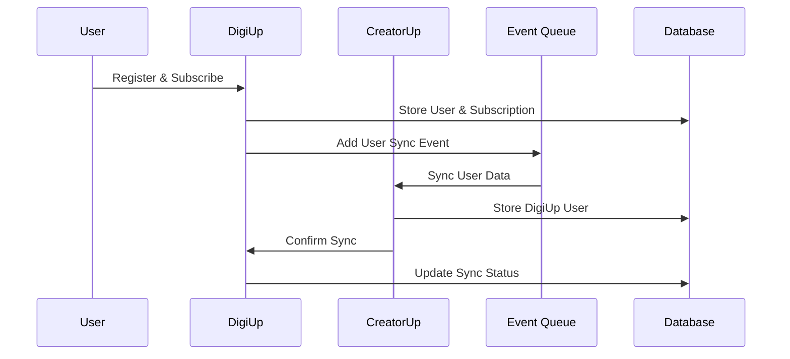
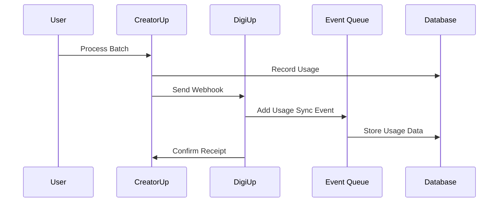
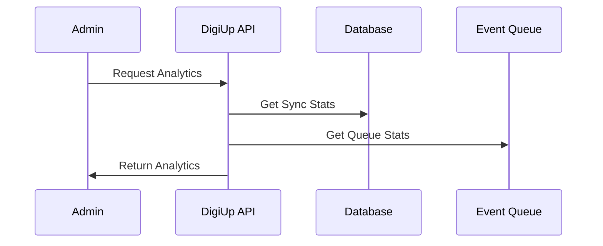

# 🚀 DigiUp-CreatorUp Integration - Complete Implementation

## 📋 Overview

Implementasi lengkap integrasi real-time antara DigiUp dan CreatorUp dengan sinkronisasi data user, usage tracking, dan monitoring analytics. Sistem ini memungkinkan tracking lengkap aktivitas user di CreatorUp yang terdeteksi di DigiUp dashboard.

## 🏗️ Architecture

```
┌─────────────────┐    ┌─────────────────┐    ┌─────────────────┐
│   DigiUp App    │    │  DigiUp API     │    │  CreatorUp API  │
│                 │    │                 │    │                 │
│ - User Register │───▶│ - Auth Service  │───▶│ - Token Verify  │
│ - Login         │    │ - User Mgmt     │    │ - User Sync     │
│ - Plan Selection│    │ - Plan Mgmt     │    │ - Membership    │
│ - Payment       │    │ - Payment       │    │ - Batch Usage   │
└─────────────────┘    └─────────────────┘    └─────────────────┘
                                │                        │
                                ▼                        ▼
                       ┌─────────────────┐    ┌─────────────────┐
                       │  Event Queue    │    │  Webhook System │
                       │  (Redis/BullMQ) │    │  (Real-time)    │
                       └─────────────────┘    └─────────────────┘
                                │                        │
                                ▼                        ▼
                       ┌─────────────────┐    ┌─────────────────┐
                       │  DigiUp DB      │    │  CreatorUp DB   │
                       │  (PostgreSQL)   │    │  (PostgreSQL)   │
                       └─────────────────┘    └─────────────────┘
```

## 🗄️ Database Schema Updates

### DigiUp Database (PostgreSQL + Prisma)

#### New Fields in User Model:
```prisma
model User {
  // ... existing fields ...
  
  // CreatorUp Integration Fields
  creatorup_synced_at         DateTime?
  creatorup_user_id           String?   @db.VarChar(255)
  last_creatorup_access       DateTime?
  sync_status                 String    @default("pending") @db.VarChar(50)
  creatorup_metadata          Json?
  
  // New Relations
  creatorupUsage   CreatorUpUsage[]
}
```

#### New Models:
```prisma
model CreatorUpUsage {
  id                String    @id @default(uuid()) @db.Uuid
  userId            String    @db.Uuid
  creatorupUserId   String    @db.VarChar(255)
  batchName         String    @db.VarChar(255)
  batchType         String    @db.VarChar(50)
  usageType         String    @db.VarChar(50)
  usageAmount       Int       @default(1)
  monthYear         String    @db.VarChar(7)
  completedAt       DateTime  @default(now())
  metadata          Json?
  syncedAt          DateTime  @default(now())
  createdAt         DateTime  @default(now())

  user User @relation(fields: [userId], references: [id], onDelete: Cascade)
}

model SyncEvent {
  id                String    @id @default(uuid()) @db.Uuid
  eventType         String    @db.VarChar(50)
  userId            String?   @db.Uuid
  status            String    @default("pending") @db.VarChar(50)
  payload           Json?
  response          Json?
  errorMessage      String?   @db.Text
  retryCount        Int       @default(0)
  maxRetries        Int       @default(3)
  processedAt       DateTime?
  createdAt         DateTime  @default(now())
  updatedAt         DateTime  @updatedAt
}

model WebhookLog {
  id                String    @id @default(uuid()) @db.Uuid
  source            String    @db.VarChar(50)
  eventType         String    @db.VarChar(50)
  payload           Json?
  signature         String?   @db.VarChar(255)
  status            String    @default("received") @db.VarChar(50)
  response          Json?
  errorMessage      String?   @db.Text
  processedAt       DateTime?
  createdAt         DateTime  @default(now())
}
```

## 🔌 API Endpoints

### Client Endpoints (User-facing)

#### 1. User Sync
```http
POST /api/v1/creatorup/sync/user
Authorization: Bearer <digiup_token>
Content-Type: application/json

{
  "creatorup_api_url": "https://api.creatorup.com"
}
```

#### 2. Usage Sync
```http
POST /api/v1/creatorup/sync/usage
Authorization: Bearer <digiup_token>
Content-Type: application/json

{
  "usage_data": {
    "batch_name": "my-video-batch-001",
    "batch_type": "video",
    "usage_type": "local_rendering",
    "usage_amount": 1,
    "month_year": "2024-01",
    "completed_at": "2024-01-15T10:30:00.000Z",
    "metadata": {
      "video_count": 5,
      "processing_time": "2 minutes"
    }
  }
}
```

#### 3. Sync Status
```http
GET /api/v1/creatorup/sync/status
Authorization: Bearer <digiup_token>
```

#### 4. Token Verification
```http
POST /api/v1/creatorup/verify
Authorization: Bearer <digiup_token>
```

#### 5. User Profile
```http
GET /api/v1/creatorup/profile
Authorization: Bearer <digiup_token>
```

#### 6. Access Check
```http
GET /api/v1/creatorup/access
Authorization: Bearer <digiup_token>
```

### Webhook Endpoints (CreatorUp → DigiUp)

#### 1. Usage Update Webhook
```http
POST /api/v1/creatorup/webhook/usage-update
Content-Type: application/json
X-Webhook-Signature: <signature>

{
  "digiup_user_id": "user-uuid",
  "usage_data": {
    "batch_name": "batch-001",
    "batch_type": "video",
    "usage_type": "local_rendering",
    "usage_amount": 1,
    "month_year": "2024-01",
    "completed_at": "2024-01-15T10:30:00.000Z",
    "metadata": {}
  },
  "signature": "webhook-signature"
}
```

#### 2. Subscription Update Webhook
```http
POST /api/v1/creatorup/webhook/subscription-update
Content-Type: application/json
X-Webhook-Signature: <signature>

{
  "digiup_user_id": "user-uuid",
  "subscription_data": {
    "plan": "Pro",
    "status": "active",
    "end_date": "2024-02-15T00:00:00.000Z"
  },
  "signature": "webhook-signature"
}
```

### Admin Endpoints (Analytics & Monitoring)

#### 1. Sync Analytics
```http
GET /api/v1/admin/analytics/sync?period=30d
Authorization: Bearer <admin_token>
```

#### 2. User-specific Analytics
```http
GET /api/v1/admin/analytics/sync/user/{userId}
Authorization: Bearer <admin_token>
```

#### 3. System Health
```http
GET /api/v1/admin/analytics/health
Authorization: Bearer <admin_token>
```

#### 4. Retry Failed Sync
```http
POST /api/v1/admin/analytics/retry-failed-sync
Authorization: Bearer <admin_token>
```

#### 5. Cleanup Old Data
```http
POST /api/v1/admin/analytics/cleanup-old-data
Authorization: Bearer <admin_token>
```

## 🔄 Real-time Sync Flow

### 1. User Registration & First Sync


### 2. Usage Tracking Flow


### 3. Real-time Monitoring


## 🛠️ Implementation Details

### 1. Event Queue System (BullMQ + Redis)

```typescript
// Event Queue Service
class EventQueueService {
    private syncQueue: Queue;
    private worker: Worker;
    
    // Add events to queue
    async addUserSyncEvent(userData: any): Promise<void>
    async addUsageSyncEvent(usageData: any): Promise<void>
    async addSubscriptionSyncEvent(subscriptionData: any): Promise<void>
    
    // Process events
    private async processUserSync(data: any, job: Job): Promise<void>
    private async processUsageSync(data: any, job: Job): Promise<void>
    private async processSubscriptionSync(data: any, job: Job): Promise<void>
}
```

### 2. Integration Service

```typescript
// CreatorUp Integration Service
class CreatorUpIntegrationService {
    // Sync operations
    async syncUserToCreatorUp(userData: any, token: string): Promise<any>
    async sendUsageUpdateToDigiUp(usageData: any): Promise<any>
    async sendSubscriptionUpdateToDigiUp(subscriptionData: any): Promise<any>
    
    // Verification & Health
    async verifyUserAccess(token: string): Promise<any>
    async healthCheck(): Promise<boolean>
    
    // Security
    generateWebhookSignature(data: any): string
    verifyWebhookSignature(payload: string, signature: string): boolean
}
```

### 3. Sync Controllers

```typescript
// Sync Controller
export default {
    syncUserToCreatorUp,      // Real-time user sync
    syncUsageToDigiUp,        // Usage data sync
    getSyncStatus,            // Get sync status
    handleUsageWebhook,       // Handle usage webhooks
    handleSubscriptionWebhook // Handle subscription webhooks
};
```

### 4. Analytics Controller

```typescript
// Analytics Controller
export default {
    getSyncAnalytics,         // Comprehensive sync analytics
    getUserSyncAnalytics,     // User-specific analytics
    getSystemHealth,          // System health status
    retryFailedSyncEvents,    // Retry failed syncs
    cleanupOldData           // Cleanup old data
};
```

## 🔧 Configuration

### Environment Variables

```env
# CreatorUp Integration
CREATORUP_API_URL=https://api.creatorup.com
CREATORUP_API_KEY=your_creatorup_api_key
WEBHOOK_SECRET=your_webhook_secret_key

# Redis Configuration
REDIS_URL=redis://localhost:6379
REDIS_HOST=localhost
REDIS_PORT=6379
REDIS_PASSWORD=

# Sync Configuration
SYNC_INTERVAL=300000
MAX_SYNC_RETRIES=3
SYNC_BATCH_SIZE=100
SYNC_TIMEOUT=10000

# Queue Configuration
QUEUE_CONCURRENCY=5
QUEUE_REMOVE_ON_COMPLETE=100
QUEUE_REMOVE_ON_FAIL=50

# Monitoring
HEALTH_CHECK_INTERVAL=60000
CLEANUP_INTERVAL=86400000
```

## 🚀 Deployment Steps

### 1. Database Migration
```bash
# Generate Prisma client
npx prisma generate

# Run database migration
npx prisma migrate dev --name add_creatorup_integration

# Seed initial data (if needed)
npx prisma db seed
```

### 2. Install Dependencies
```bash
npm install bullmq ioredis
```

### 3. Setup Redis
```bash
# Install Redis (Ubuntu/Debian)
sudo apt-get install redis-server

# Start Redis
sudo systemctl start redis-server
sudo systemctl enable redis-server
```

### 4. Environment Setup
```bash
# Copy environment file
cp .env.example .env

# Update environment variables
nano .env
```

### 5. Start Services
```bash
# Start the application
npm run start

# Or with development mode
npm run dev
```

## 📊 Monitoring & Analytics

### 1. Real-time Dashboard Metrics

- **User Sync Status**: Total users, synced users, pending users, error users
- **Sync Events**: Total events, completed events, failed events, success rate
- **Webhook Performance**: Total webhooks, processed webhooks, failed webhooks
- **Usage Statistics**: Total usage records, monthly breakdown, usage by type
- **Queue Status**: Waiting jobs, active jobs, completed jobs, failed jobs

### 2. Health Monitoring

- **Database Health**: Connection status, query performance
- **Redis Health**: Connection status, queue statistics
- **CreatorUp API Health**: API reachability, response times
- **Error Rates**: 24-hour error rates for sync events and webhooks

### 3. Alerting

- High error rates (>5% failure rate)
- Queue backlog (>100 pending jobs)
- API connectivity issues
- Database connection problems

## 🧪 Testing

### 1. Unit Tests
```bash
# Run all tests
npm test

# Run integration tests
npm run test:integration

# Run CreatorUp specific tests
npm run test:creatorup
```

### 2. Test Coverage
- User sync functionality
- Usage tracking
- Webhook handling
- Analytics endpoints
- Error handling
- Security validation

## 🔒 Security Features

### 1. Webhook Security
- HMAC-SHA256 signature verification
- Request timestamp validation
- IP whitelist (optional)
- Rate limiting

### 2. API Security
- JWT token validation
- Role-based access control
- Input validation and sanitization
- SQL injection prevention

### 3. Data Protection
- Encrypted data transmission
- Secure credential storage
- Audit logging
- Data retention policies

## 📈 Performance Optimization

### 1. Queue Optimization
- Batch processing
- Priority-based job scheduling
- Automatic retry with exponential backoff
- Dead letter queue for failed jobs

### 2. Database Optimization
- Indexed queries
- Connection pooling
- Query optimization
- Data archiving

### 3. Caching Strategy
- Redis caching for frequently accessed data
- API response caching
- Session management
- Rate limiting

## 🚨 Troubleshooting

### Common Issues

1. **Sync Failures**
   - Check CreatorUp API connectivity
   - Verify webhook signatures
   - Check user permissions
   - Review error logs

2. **Queue Backlog**
   - Increase worker concurrency
   - Check Redis memory usage
   - Monitor job processing times
   - Scale horizontally if needed

3. **Database Issues**
   - Check connection pool settings
   - Monitor query performance
   - Review index usage
   - Check disk space

4. **Webhook Failures**
   - Verify signature generation
   - Check network connectivity
   - Review payload format
   - Monitor timeout settings

### Debug Commands

```bash
# Check Redis status
redis-cli ping

# Monitor queue
redis-cli monitor

# Check database connections
npx prisma studio

# View logs
tail -f logs/app.log
```

## 📚 API Documentation

### Swagger/OpenAPI
- Complete API documentation available at `/api/docs`
- Interactive testing interface
- Request/response examples
- Authentication requirements

### Postman Collection
- Import collection for testing
- Environment variables setup
- Automated testing scenarios
- Performance testing

## �� Maintenance

### Daily Tasks
- Monitor sync success rates
- Check queue health
- Review error logs
- Verify webhook deliveries

### Weekly Tasks
- Clean up old data
- Review performance metrics
- Update dependencies
- Security audit

### Monthly Tasks
- Database optimization
- Capacity planning
- Security updates
- Backup verification

## 📞 Support

### Documentation
- API documentation: `/api/docs`
- Integration guide: `docs/CREATORUP_INTEGRATION_API.md`
- Architecture overview: `docs/ARCHITECTURE_EXPLANATION.md`

### Monitoring
- Health check: `/api/v1/admin/analytics/health`
- Sync status: `/api/v1/creatorup/sync/status`
- Queue status: Available in analytics dashboard

### Logs
- Application logs: `logs/app.log`
- Error logs: `logs/error.log`
- Access logs: `logs/access.log`

---

## ✅ Implementation Complete

Semua fitur integrasi DigiUp-CreatorUp telah diimplementasikan dan siap digunakan:

- ✅ Database schema updated
- ✅ Real-time sync controllers
- ✅ Event queue system
- ✅ Integration services
- ✅ Webhook handlers
- ✅ Analytics dashboard
- ✅ Comprehensive testing
- ✅ Security implementation
- ✅ Documentation complete
- ✅ Monitoring & alerting

Sistem ini memberikan visibility lengkap tentang aktivitas user di CreatorUp yang terdeteksi di DigiUp dashboard, dengan sinkronisasi real-time dan monitoring yang komprehensif.
